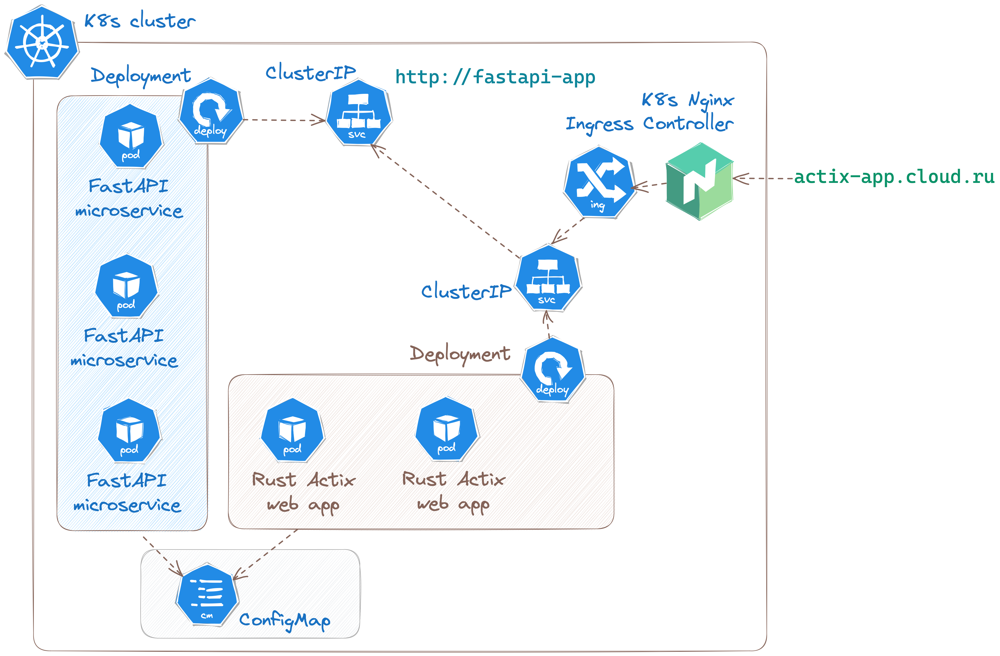

# Kubernetes cluster

## Usage

```bash
# here ingress is used:
$ make write

# run config files
$ kubectl apply -f .

# or run separately
$ kubectl apply -f cm.yml
$ kubectl apply -f setup.yml
$ kubectl apply -f actix-app-steup.yml
$ kubectl apply -f ingress.yml

# stop server, free resourses and delete ip->host link line
$ kubectl delete -f cm.yml
$ make delete_on_mac
```

Test app response:

```bash
$ curl -i http://actix-app.cloud.ru/check_fastapi_app
```

```
HTTP/1.1 200 OK
Date: Fri, 08 Sep 2023 12:20:22 GMT
Content-Length: 379
Connection: keep-alive

Routes {
    data: [
        (
            "/hostname",
            "Hostname { hostname: \"fastapi-84d9cfdcdf-t5cvr\" }",
        ),
        (
            "/author",
            "Author { author: \"Gleb Komissarov (taken from k8s ConfigMap)\" }",
        ),
        (
            "/id",
            "PodID { uuid: \"1b985e19-c565-4b29-8fbb-749a4d521cc9\" }",
        ),
    ],
}%
```

## Step by step

<center>
<figure>
    
    <figcaption><i>General schema of K8s cluster</i></figcaption>
</figure>
</center>

Check that kubernetes is working and ready to go:

```bash
# check that cluster is live
$ kubectl cluster-info
```

```bash
# run deployment
$ kubectl apply -f setup.yml

# check that deployment is running
$ kubectl get deploy -n cloudns
```

```bash
$ kubectl get pods -n cloudns
```

```bash
# get list of pods
$ kubectl logs <pod-name> -n cloudns
# go inside pod
$ kubectl exec -it <pod-name> -- /bin/sh

$ k describe deploy fastapi -n cloudns

$ k describe replicaset <rs-name> -n cloudns
```

### Configure Ingress

As Ingress Controller we will use K8s [Ingress-Nginx](https://kubernetes.github.io/ingress-nginx/deploy/) Controller. Let's run ingress controller.

Ingormation about Ingress-Nginx controller:

```bash
$ kubectl get pods -n ingress-nginx -o wide
```

Setup ingress rules:

```bash
$ kubectl apply -f ingress.yml

# check
$ kubectl get ingress -n cloudns
```

Let's make domain name valid (link ip adress with some domain name). We want to access to Actix app by `https://actix-app.cloud.ru`

```bash
$ sudo nvim /etc/hosts
# and add line:
# 127.0.0.1   actix-app.cloud.ru
```

Delete ingress-nginx controller:

```bash
$ kubectl get ns

$ kubectl delete all --all -n ingress-nginx
```
