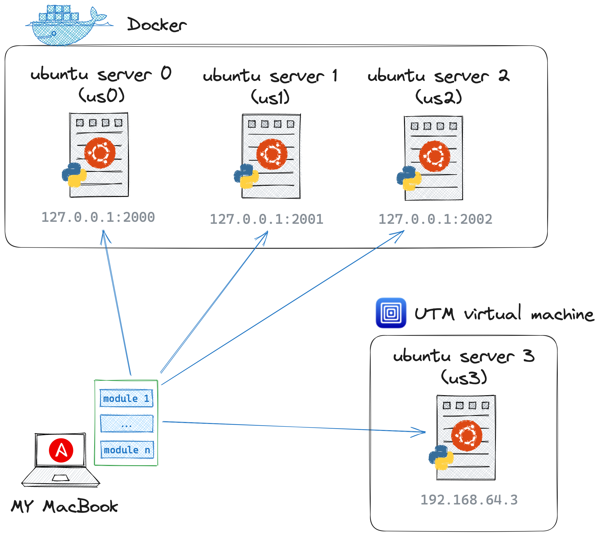

# Ansible playbook

## Usage

Run ansible playbook:

```bash
$ ansible-playbook -i inventory.ini --vault-password-file .pass user-create.yml
```

## Step by step

### 1. Creation of servers with Docker and UTM

First of all, we need to create several _servers_ to performe some operations under them using Ansible. In this case we will use Docker where several containers will be started (they will mimic working servers) and UTM virtual machine for Mac (where Ubuntu Server 20.04 will ne running).

Docker containers are based on custom image described in `./init-servers/Dockerfile` (with ubuntu as base image). The official ubuntu image doesn't have python installed that is nessesary for Absible to work on server because Ansible convert yaml config files to python commands and these python commands should be executed on server. Also to connect to server by ssh, we need _ssh-server_ running.

> [!WARNING]
> The Docker ubuntu images are limited and don't properly work. :(

```bash
# build image
$ docker build -t glebcom/ubuntu-server:0.1 ./init-servers

# run containers
$ chmod +x init-servers/run_servers
$ ./init-servers/run_servers
```

Let's connect to some of Docker containers:

```bash
# connect to server using Docker
docker exec -it us1 bash

# to connect with password (here 127.0.0.1 is localhost)
ssh  root@127.0.0.1 -p 2200

# to connect with ssh key
# [!]: if you are not able to connect by ssh
#      - delete ~/.ssh/known_hosts from local machine: rm ~/.ssh/known_hosts
ssh -i ~/.ssh/root_rsa  root@localhost -p 2200
```

Also I have _UTM ubuntu server_ running with `192.168.64.3` ip addres. Notice that `/etc/sudoers` file contains `%sudo   ALL=(ALL:ALL) NOPASSWD: ALL` line, so this server will _not require_ password input for _sudo_. Ubuntu server has two users - `root:root` and `cloud:cloud`. Let's connect to it (to `cloud` user) with ssh public key:

```bash
$ ssh -i ~/.ssh/root_rsa cloud@192.168.64.3
```

<center>
<figure>
    
    <figcaption><i>General schema of servers setup</i></figcaption>
</figure>
</center>

### 2. Add new user with Ansible

Let's check that our servers inside Docker works fine and can process Ansible commands:

```bash
# validate inventory
$ ansible-inventory -i inventory.ini --list

# check connection
# here 'all' stands for ALL groups of servers (docker_servers and utm_ubuntu_server)
$ ansible -i inventory.ini -m ping all
```

Password for `cloudru` user is stored in `group_vars/all/vault.yml` and encrypted by `ansible-vault` (with password from `./.pass` file).

```bash
$ ansible-vault view ./group_vars/all/vault.yml --vault-id .pass
```

```
userpass: cloudpass
```

Let's add new user `cloudru`:

```bash
$ ansible-playbook -i inventory.ini --vault-password-file .pass user-create.yml
```

Done!

Now let's try to login:

```bash
# to ubuntu server in Docker container
ssh  cloudru@127.0.0.1 -p 2200 # OK !!!
# to ubuntu server on UTM virtual machine
ssh  cloudru@192.168.64.3 # OK !!!


ssh -i ~/.ssh/root_rsa  cloudru@localhost -p 2201
ssh -i ~/.ssh/root_rsa  cloudru@192.168.64.3
# OK !!!

ssh  root@127.0.0.1 -p 2200
ssh  root@192.168.64.3
# ERROR

ssh -i ~/.ssh/root_rsa  root@192.168.64.3
```

To delete user - just run:

```bash
$ ansible-playbook -i inventory.ini --vault-password-file .pass user-remove.yml
```
